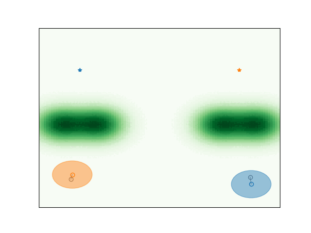
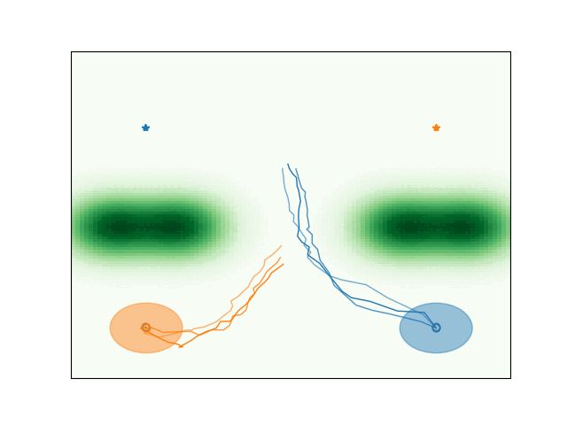
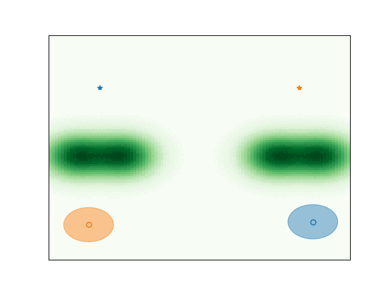
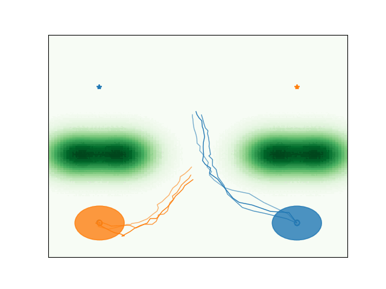

# Online_neurSLS

This repository accompanies the paper **"Stabilizing Online Adaptation of Stable Neural Closed-loop Maps"** by Danilo Saccani, Luca Furieri, and Giancarlo Ferrari Trecate. 
It implements **Online Neural System Level Synthesis (Online neuroSLS)** using Recurrent Equilibrium Networks (RENs). 
The neuroSLS framework enables learning over all stabilizing policies for nonlinear systems, ensuring closed-loop stability by design.
The proposed approach allows the online adaptation of the neural closed-loop maps.

## Features

- Implementation of neuro SLS from "Neural System Level Synthesis: Learning over All Stabilizing Policies for Nonlinear Systems
" and proposed approach online neuro SLS.
- Offline and online training examples.
- Stability guarantees during training.
- Pretrained models and visualization tools.

## Installation

Clone the repository and install dependencies:

```bash
git clone https://github.com/DaniloSaccani/Online_neurSLS.git
cd Online_neurSLS
python -m venv env
source env/bin/activate  # On Windows, use 'env\Scripts\activate'
pip install -r requirements.txt
```

## Repository Structure

```
Online_neurSLS/
│── src/                     # Source code
│   │── main.py              # Training script
│   │── utils.py             # Utility functions
│   │── models.py            # Neural network models
│   │── plots.py             # Visualization tools
│── trained_models/         # Pretrained models
│── GIF/                    # Performance demonstrations
│── Main_OfflineT_neurSLS_obstacles.ipynb  # Offline training neuro SLS (dynamic obstacles example)
│── Main_Offline_neurSLS_mountains.ipynb   # Offline training neuro SLS (mountains example)
│── Main_Online_neurSLS_mountains.ipynb    # Online update with the proposed approach (mountains example)
│── README.md                # Documentation
```

### Prerequisites

- Dependencies listed in `requirements.txt`

## Usage

Run the provided Jupyter notebooks for offline and online training:

1. **Launch Jupyter Notebook**:
   ```bash
   jupyter notebook
   ```
2. **Open the desired notebook**:
   - `Main_OfflineT_neurSLS_obstacles.ipynb`
   - `Main_Offline_neurSLS_mountains.ipynb`
   - `Main_Online_neurSLS_mountains.ipynb`
3. **Run the notebook cells** to train and evaluate the neurSLS controllers.


### Installation

1. Cloning the Repository

```bash
git clone https://github.com/DecodEPFL/Distributed_neurSLS.git
```

2. Navigate to the cloned directory:

```bash
cd Distributed_neurSLS
```
3. Install the required dependencies. We recommend using a virtual environment:
```bash
python -m venv venv
source venv/bin/activate  # Activate the virtual environment (Linux/macOS)
pip install -r requirements.txt
```

### Usage
1. Adjust parameters in utils.py as needed.
2. Run the main script to start training:
```bash
python main.py
```
## Example

### Coordination in mountains problem 

The following gifs show trajectories of the vehicles with :
- (Left) Approach proposed in "Neural System Level Synthesis: Learning over All Stabilizing Policies for Nonlinear Systems".
- (Right) Proposed Online neurSLS approach.
#### Mountains problem

<p align="center">


</p> 

#### Mountains problem with sudden impulse $\delta$
<p align="center">


</p> 

#### Dynamic obstacles problem
<p align="center">


</p> 

## License
This work is licensed under a
[Creative Commons Attribution 4.0 International License][cc-by].

[![CC BY 4.0][cc-by-image]][cc-by] 

[cc-by]: http://creativecommons.org/licenses/by/4.0/
[cc-by-image]: https://i.creativecommons.org/l/by/4.0/88x31.png
[cc-by-shield]: https://img.shields.io/badge/License-CC%20BY%204.0-lightgrey.svg